# Web Session Analytics — Summary Report

**Generated:** 2026-03-12
**Dataset:** data/data.csv | **Clean rows:** 1925 | **Dirty rows removed:** 75

---

## 1. Data Quality

| Reason | Count |
| --- | --- |
| session_duration_too_short | 61 |
| page_views_invalid | 13 |
| time_on_page_too_short | 1 |

75 rows removed (3.8% of raw data).

---

## 2. Dataset Overview

| Column | Mean | Median | Std | Min | Max |
| --- | --- | --- | --- | --- | --- |
| Page Views | 4.9782 | 5.0 | 2.1475 | 1.0 | 14.0 |
| Session Duration | 3.1204 | 2.1185 | 3.1135 | 0.1012 | 20.2905 |
| Bounce Rate | 0.2851 | 0.2668 | 0.16 | 0.0079 | 0.8449 |
| Time on Page | 4.0448 | 3.3201 | 2.9015 | 0.1025 | 24.7962 |
| Previous Visits | 1.9699 | 2.0 | 1.4249 | 0.0 | 9.0 |
| Conversion Rate | 0.9839 | 1.0 | 0.0614 | 0.3437 | 1.0 |

---

## 3. Traffic Source Analysis

| Traffic Source | Avg Session Duration | Avg Bounce Rate | Avg Conversion Rate |
| --- | --- | --- | --- |
| Direct | 2.8126 | 0.2868 | 0.9802 |
| Organic | 3.1865 | 0.2811 | 0.9836 |
| Paid | 3.0862 | 0.2987 | 0.9826 |
| Referral | 3.2148 | 0.2656 | 0.9881 |
| Social | 3.1184 | 0.2963 | 0.985 |

- **Best source for conversion:** Referral
- **Highest engagement (session duration):** Referral
- **Lowest bounce rate:** Referral

---

## 4. Conversion Insights

- **New visitors** (Previous Visits = 0) mean Conversion Rate: **0.9698**
- **Returning visitors** (Previous Visits > 0) mean Conversion Rate: **0.9862**
- Top feature correlated with Conversion Rate: **Time on Page** (r = 0.2193)

---

## 5. Statistical Significance

| target | H_stat | p_value | significant |
| --- | --- | --- | --- |
| Session Duration | 2.5643 | 0.6332 | No |
| Bounce Rate | 9.8492 | 0.043 | Yes |
| Conversion Rate | 3.6097 | 0.4614 | No |
| Page Views | 4.0141 | 0.4041 | No |
| Time on Page | 4.162 | 0.3845 | No |

Differences across Traffic Sources are statistically significant (p < 0.05) for: Bounce Rate.

---

## 6. Key Findings

1. **Referral** delivers the highest average Conversion Rate among all traffic sources.
2. **Referral** drives the longest sessions, indicating strong content engagement.
3. **Referral** achieves the lowest bounce rate, suggesting high landing-page relevance.
4. Returning visitors convert at a higher rate than new visitors.
5. Kruskal-Wallis tests confirm significant variation across sources for Bounce Rate.

---

## 7. Plots

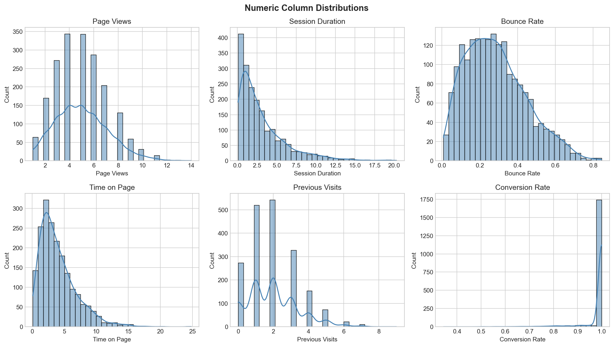
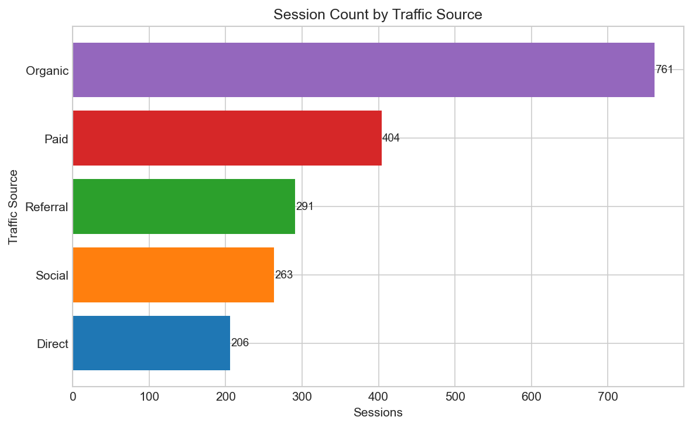
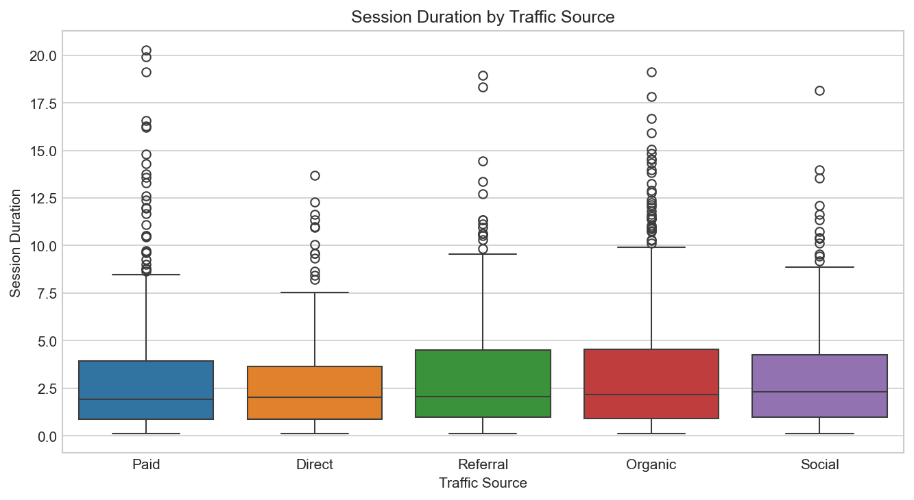
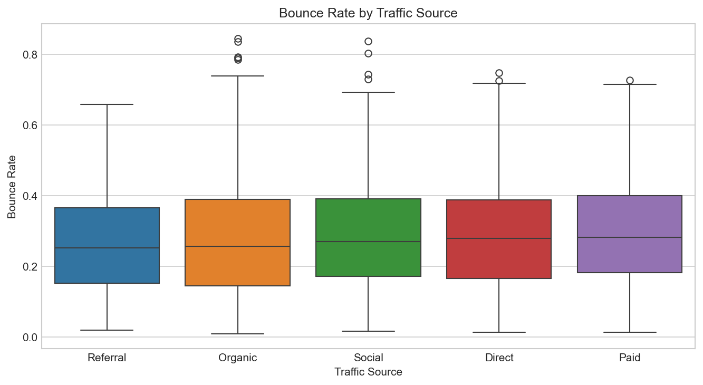
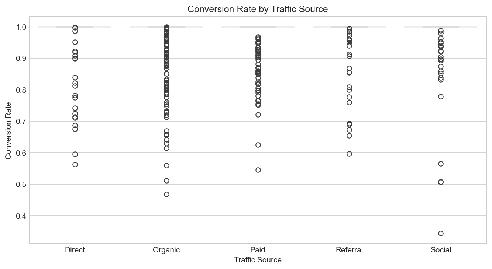
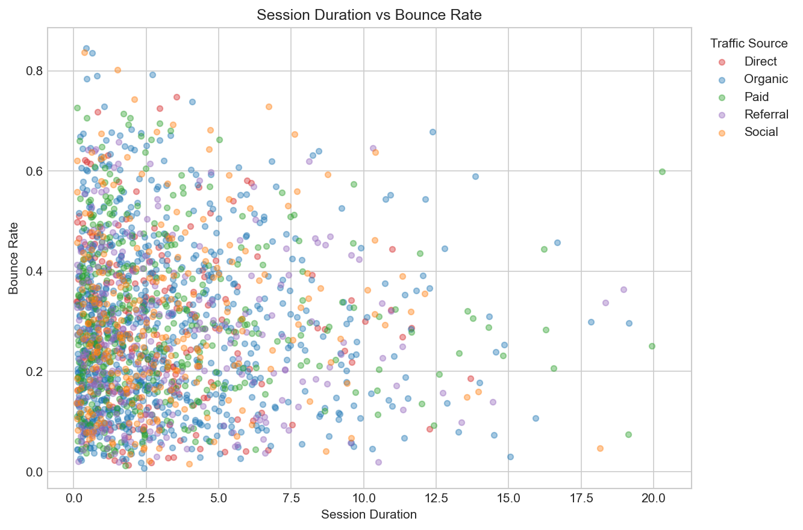
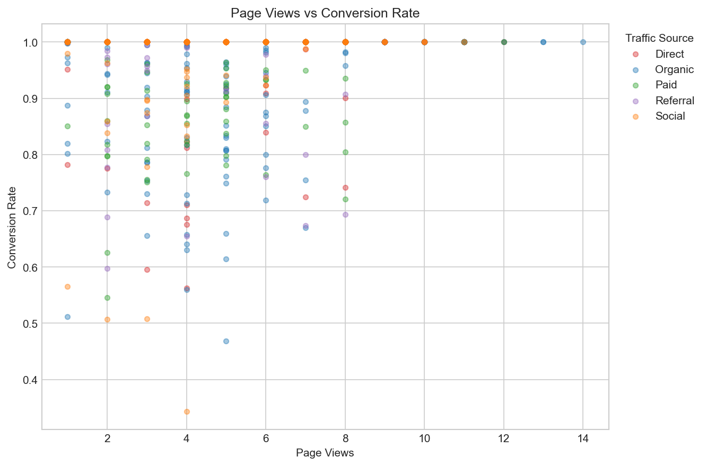
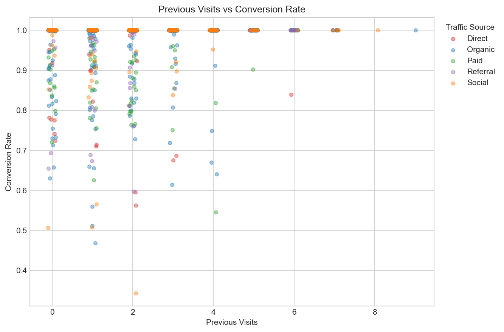
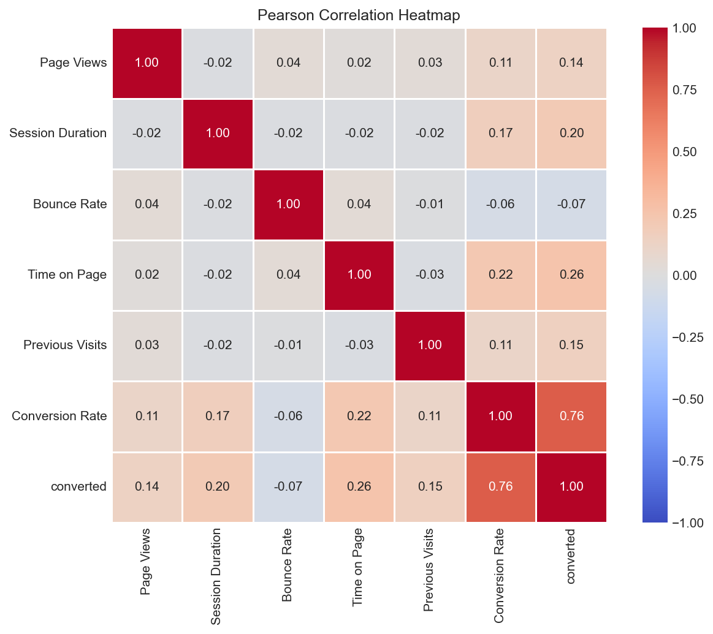
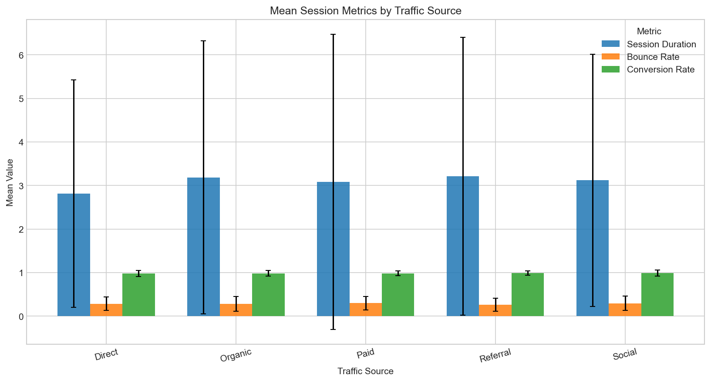
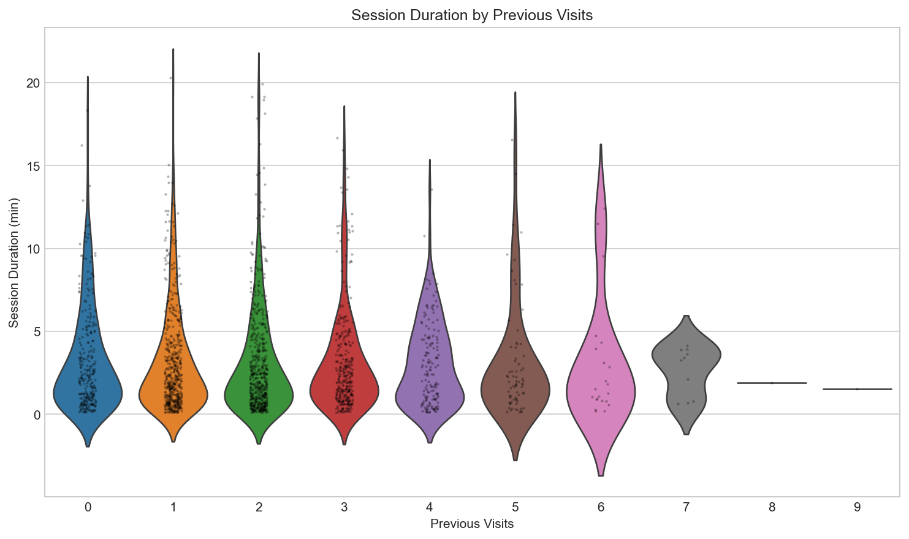
